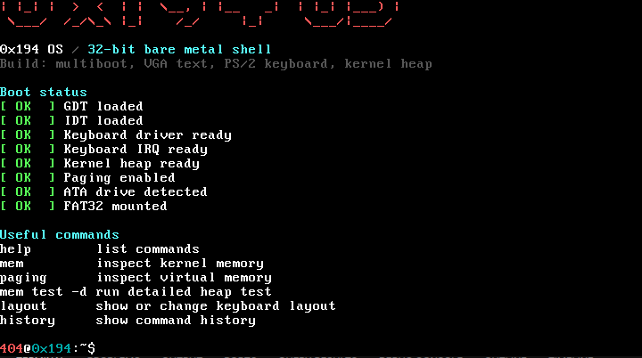
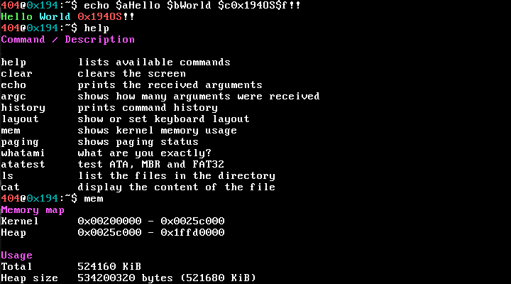

# 0x194OS

0x194 = 404. do the math.

0x194OS is a bare-metal x86 operating system written in C.
It boots in QEMU and on real hardware, gives you a shell to play with and is where the usual low-level pieces get built one by one.

Every command, every color on the screen, every bit of input handling, and every file read from disk is running on code from this repo.

## Screenshots

Booting into the shell:



Some shell commands in action:



## What works right now

- Multiboot boot flow through GRUB
- 32-bit protected mode kernel
- GDT and IDT
- VGA text output with inline color codes (`$a`, `$b`, `$c`...)
- PS/2 keyboard driver with Portuguese and US layouts
- Shift and Caps Lock support
- Interactive shell with editable input, cursor, and scrollback
- Command history with timestamps
- Kernel heap with `kmalloc` / `kfree`
- Basic paging
- ATA PIO driver that detects and reads from disk
- MBR partition table parser
- FAT32 read-only driver that mounts, reads files and directories
- VFS abstraction layer over FAT32
- System info command (`whatami`), reads CPU, GPU, RAM, disk, date and time
- Tab autocomplete for shell commands

## Commands

```text
help          list available commands
clear         clear the screen
echo          print text with color codes
history       show command history with timestamps
layout        show or change keyboard layout
mem           inspect kernel memory
mem test      run a small heap test
mem test -d   run the heap test with step-by-step output
paging        inspect virtual memory
whatami       show system information
ls            list files in the root directory
ls <path>     list files in a specific directory
cat <path>    read and print a file
```

## Dependencies

```bash
sudo apt install gcc qemu-system-x86 grub-pc-bin xorriso make
```

## Running

```bash
git clone https://github.com/AFaria20s/0x194OS
cd 0x194OS
make run
```

The disk image is created automatically on first run.

## Build ISO only

```bash
make
```

## Notes

The ATA driver uses legacy PIO mode (ports 0x1F0-0x1F7).
- **QEMU**: works out of the box
- **VirtualBox**: set the storage controller to IDE (PIIX4), not SATA/AHCI
- **Real hardware**: works if BIOS has IDE compatibility mode enabled

Built by hand, one piece at a time.